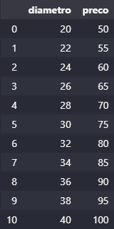

## TREINAMENTO DE MODELO DE ML PARA PREVER O VALOR DE UMA PIZZA

- Primeiro importamos o arquivo data frame pizzas.csv

- A partir desta base, treinaremos nosso modelo supervisionado para prever, e construiremos uma interface no streamlit.

## testes.ipynb

- Neste arquivo faço e explico passo a passo como treinar este modelo de regressão linear

## app.py

- Neste arquivo eu integro uma interface do streamlit.

